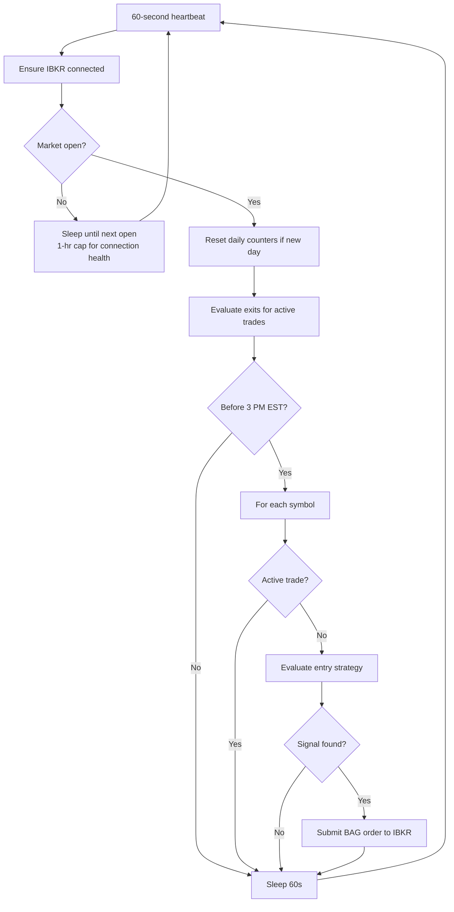
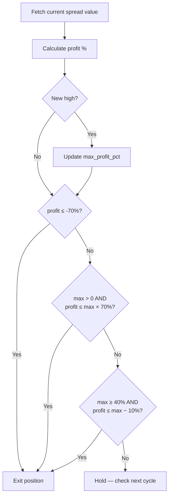

# How the 0DTE Trading Bot Works

This document explains the full lifecycle of the bot — from startup and market-hours management through entry scanning, order execution, position monitoring, and exit rules.

---

## 1. Startup

```bash
python src/main.py
```

`main.py` first creates an asyncio event loop (required for Python 3.10+ compatibility with `ib_insync`), then instantiates `TradingBot`, which:

1. Connects to IBKR via IB Gateway or TWS using the host/port from `.env`
2. Requests **delayed market data (type 4)** — no live subscription needed for paper trading
3. Silences `ib_insync`'s internal error logger and subscribes to `errorEvent` to route IBKR messages itself — suppressing expected info codes (162, 2104, 2106, 10091, 10167, etc.) and surfacing real problems as `WARNING`
4. Enters the main `while True:` loop

---

## 2. The Heartbeat Loop

The loop runs every **60 seconds** using `ib.sleep(60)` — not Python's `time.sleep`. The ib_insync version keeps the IBKR event loop alive during the wait, so order fills and market data callbacks are processed in real time.

Each iteration:

```
ensure connected
│
├─ Market closed?
│   └─ Calculate seconds to next 9:30 AM EST weekday open
│       ├─ > 1 hour away → sleep 1 hour (wake hourly to keep IBKR alive)
│       └─ ≤ 1 hour away → sleep exactly until open
│
├─ Reset daily counters if it's a new trading day
├─ Evaluate exit conditions for all active trades
│
└─ Entry window open? (before 3:00 PM EST)
    └─ For each symbol (SPY, QQQ, IWM):
        └─ No active trade? → evaluate entry strategy → execute if signal found
```



---

## 3. Smart Sleep (Market Closed)

When the market is closed, the bot calculates the exact number of seconds until the next 9:30 AM EST weekday open, skipping weekends. It then:

- **If > 1 hour away:** sleeps 1 hour, logs the countdown, then recalculates. This keeps the IBKR socket alive overnight and over weekends without constant reconnections.
- **If ≤ 1 hour away:** sleeps exactly until open, so the bot is ready to scan from the first minute.

Example log output over a weekend:
```
Market closed. Next open in 63h 14m. Sleeping 1 hour.
Market closed. Next open in 62h 14m. Sleeping 1 hour.
...
Market opens in 47m 12s. Sleeping until open.
Daily trade count reset for 2026-05-26
```

---

## 4. Daily Reset

At the start of each new trading day, `check_and_reset_daily_trade_count()` resets:
- `daily_trade_count → 0`
- `signal_cooldowns → {}` (all cooldowns cleared)
- `consecutive_losses → 0`
- `circuit_breaker_tripped → False`

---

## 5. Phase 1: Entry Scanning

For each symbol with no active trade, the bot runs through these checks in order. Any failure returns early with no trade placed.

### Guard 1: Circuit Breaker
If `circuit_breaker_tripped` is True (N consecutive losses today), skip all entries. No new trades until midnight.

### Guard 2: Daily Trade Cap
If `daily_trade_count >= MAX_TRADES_PER_DAY` (default 12), skip. This is a hard safety ceiling; on normal trending days it's never hit.

### Guard 3: Signal Cooldown
After any trade (entry submitted), the `(symbol, direction)` pair is locked for `SIGNAL_COOLDOWN_MINUTES` (default 30). This prevents immediate whipsaw re-entry while still allowing continuation trades once the cooldown expires.

**Example:** SPY PUT fires at 10:05. Bot exits at 10:22. SPY PUT is locked until 10:35. If SPY is still bearish at 10:36, the bot can re-enter.

### Guard 4: One Trade Per Symbol
If a trade is already `PENDING_ENTRY` or `ACTIVE` for this symbol, skip.

### Guard 5: Fetch 1-Minute Bars

```python
ib.reqHistoricalData(contract, durationStr='1 D', barSizeSetting='1 min',
                     whatToShow='TRADES', useRTH=True)
```

After fetching, the bot:
1. **Filters to today's session only** (bars from 9:30 AM EST onward) — IBKR's `1 D` duration can include yesterday's bars
2. **Drops NaN rows** — delayed data sometimes backfills with empty rows before prices are available
3. Requires **at least 20 clean bars** before proceeding (ensures enough data for ADX warmup)

### Guard 6: Calculate Indicators

**VWAP** — Volume-Weighted Average Price from 9:30 AM EST. Reflects the institutional average cost basis for the day.

**ADX(14)** — Average Directional Index over 14 bars. A value > 25 indicates a strong directional trend. Below 25 = choppy, no trade.

**30-Minute ORB** — Opening Range Breakout. The high and low of the 9:30–10:00 AM EST window, anchored to fixed wall-clock time (not `df.index[0]`). This means restarting the bot mid-day still produces the correct morning range.

### Guard 7: Entry Signal

| Signal | Conditions |
|--------|-----------|
| **CALL** | ADX > 25 AND price > VWAP AND price > ORB High |
| **PUT** | ADX > 25 AND price < VWAP AND price < ORB Low |

If neither condition is met, no trade.

### Guard 8: Spread Pricing

The bot fetches live bid/ask from IBKR for each option leg and computes:

```
spread_cost = mid(long_leg) − mid(short_leg)
```

If `spread_cost < MIN_SPREAD_COST` ($0.10 default), skip — the spread is too cheap to be liquid.

### Execution: BAG Combo Order

IBKR represents multi-leg options as `BAG` contracts with `ComboLeg` objects:

```python
bag = Contract(secType='BAG', symbol='SPY', exchange='SMART', currency='USD')
bag.comboLegs = [
    ComboLeg(conId=long_call.conId, ratio=1, action='BUY'),
    ComboLeg(conId=short_call.conId, ratio=1, action='SELL'),
]
order = LimitOrder('BUY', qty, round(spread_cost, 2))
ibkr_trade = ib.placeOrder(bag, order)
```

Position sizing:
```
qty = floor(MAX_POSITION_SIZE / (spread_cost × 100))
```

**Immediately on submission**, a Discord ⏳ orange alert fires with the full order details (strikes, limit price, qty, indicators). This fires even if the order is later rejected by IBKR — so you always know the bot attempted an entry.

---

## 6. Phase 2: Monitoring Active Trades

Every loop iteration, `evaluate_exit_conditions_for_symbol()` runs for each active trade.

### Pending Entry Check

If status is `PENDING_ENTRY`, the bot checks the live IBKR trade object's `orderStatus.status`:

| IBKR Status | Action |
|-------------|--------|
| `Filled` | Record fill price, transition to `ACTIVE`, log BUY to `audit.csv`, send 🟢 Discord alert |
| `Cancelled` / `ApiCancelled` / `Inactive` | Remove from tracking (order was rejected or expired) |
| Anything else | Log and wait — check again next cycle |

### Active Trade: Exit Rules

Once `ACTIVE`, the bot fetches the current spread value (live bid/ask from IBKR) every 60 seconds and evaluates three rules in priority order:

#### Rule 1 — Hard Stop Loss (70%)
```
if profit_pct ≤ -0.70: EXIT
```
Exit immediately if the spread has lost 70% of its entry value. Aggressive by standard 0DTE practice (50% is typical) — set `HARD_STOP_LOSS_PCT=0.50` in `.env` to tighten.

#### Rule 2 — Max Profit Trailing Exit (70% of peak)
```
if max_profit_pct > 0 AND profit_pct ≤ max_profit_pct × 0.70: EXIT
```
The bot tracks the highest profit percentage ever seen for the trade. If current profit drops to 70% of that peak, exit.

**Example:** Entered at $1.00. Spread reaches $1.60 (+60% max). Exit threshold = +42%. If spread drops to $1.42, sell.

#### Rule 3 — Trailing Stop (10% from peak, after 40% profit)
```
if max_profit_pct ≥ 0.40 AND profit_pct ≤ max_profit_pct − 0.10: EXIT
```
Once the trade has been up 40%+, a 10% trailing stop activates.

**Example:** Spread peaks at +55%. Trailing stop = +45%. If profit drops below +45%, sell.



### Closing a Position

The bot submits a `LimitOrder('SELL', qty, current_spread_value)` on the same BAG contract used for entry. IBKR closes the spread.

After submitting:
1. **Circuit breaker counter updated** — if `profit_pct < 0`, `consecutive_losses++`; if N losses in a row, `circuit_breaker_tripped = True` and a 🚨 Discord alert fires
2. **Winning trade** resets `consecutive_losses = 0`
3. **Discord 🔵 alert** fires with P&L, exit reason, and max profit reached
4. **`audit.csv` SELL row** written with exit-time indicators
5. Symbol removed from `active_trades` → back to scanning next cycle

---

## 7. Circuit Breaker

| Condition | Action |
|-----------|--------|
| N consecutive **losing** trades (default 5) | `circuit_breaker_tripped = True`; 🚨 Discord alert; no new entries for the rest of the day |
| Any **winning** trade between losses | `consecutive_losses` resets to 0 |
| Midnight | Full reset — bot can trade again next day |

The circuit breaker fires **at close**, not at submission — it only counts confirmed losing exits.

---

## 8. Configuration Reference

All values live in `.env` and are loaded by `src/config.py`.

| Variable | Default | Description |
|----------|---------|-------------|
| `IBKR_HOST` | `127.0.0.1` | IB Gateway / TWS host |
| `IBKR_PORT` | `4002` | `4002` = IB Gateway paper, `7497` = TWS paper |
| `IBKR_CLIENT_ID` | `1` | Unique socket client ID; change if running multiple bots |
| `SYMBOLS` | `SPY,QQQ,IWM` | Comma-separated underlyings to scan |
| `MAX_POSITION_SIZE` | `300.0` | Max dollars risked per spread |
| `MAX_TRADES_PER_DAY` | `12` | Hard daily cap across all symbols |
| `SIGNAL_COOLDOWN_MINUTES` | `30` | Minutes before a (symbol, direction) signal can re-trigger |
| `MIN_SPREAD_COST` | `0.10` | Skip trade if spread mid-price is below this |
| `TAKE_PROFIT_TRAIL_TRIGGER` | `0.40` | Profit % that activates the trailing stop |
| `TRAILING_STOP_LOSS_PCT` | `0.10` | Exit if profit drops this much from peak (once trigger hit) |
| `MAX_PROFIT_EXIT_MULTIPLIER` | `0.70` | Exit if profit drops to this fraction of all-time peak |
| `HARD_STOP_LOSS_PCT` | `0.70` | Exit immediately if spread loses this fraction of entry value |
| `MAX_CONSECUTIVE_LOSSES` | `5` | Circuit breaker threshold |
| `DISCORD_WEBHOOK_URL` | _(empty)_ | Discord webhook for trade alerts |

---

## 9. Audit Log Analysis

Every fill is written to `audit.csv`. Some useful queries:

**Win rate and average P&L by symbol:**
```python
import pandas as pd
df = pd.read_csv('audit.csv')
sells = df[df['Action'] == 'SELL'].copy()
sells['Profit_Pct'] = sells['Profit_Pct'].str.replace('%','').astype(float)
print(sells.groupby('Symbol')['Profit_Pct'].agg(['mean', 'count', lambda x: (x > 0).mean()]).rename(columns={'<lambda_0>': 'win_rate'}))
```

**Which exit rule fires most often:**
```python
print(sells['Reason'].value_counts())
```

**Performance by ADX level at entry:**
```python
buys = df[df['Action'] == 'BUY'].copy()
buys['ADX'] = buys['ADX'].astype(float)
print(buys.groupby(pd.cut(buys['ADX'], bins=[25, 30, 35, 40, 100]))['Symbol'].count())
```

**Check if circuit breaker is being hit too often** (signals overly choppy days):
```python
print(sells[sells['Reason'].str.contains('Hard stop')].shape[0], 'hard stops vs', sells.shape[0], 'total exits')
```
