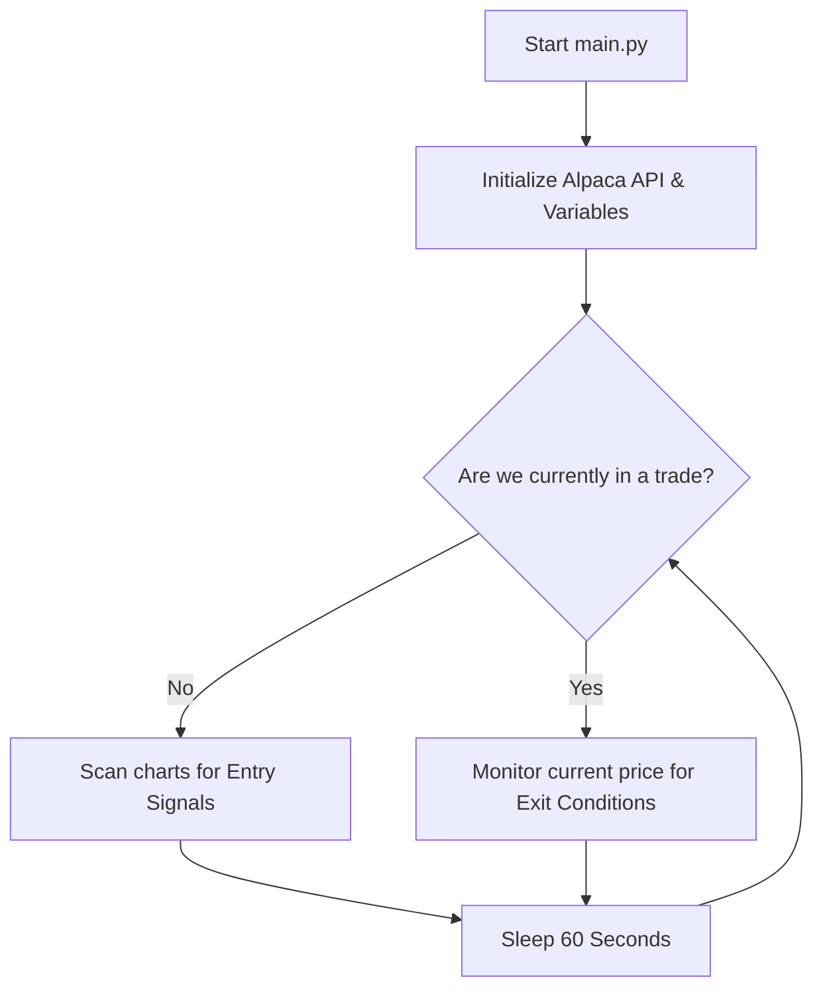
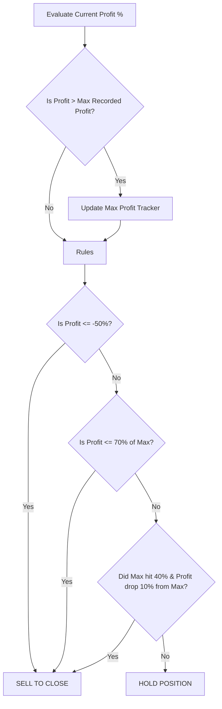

# How the 0DTE Trading Bot Works in Real-Time

This document explains the lifecycle of the `TradingBot` script, detailing how it runs continuously, evaluates charts, buys options spreads, and manages risk dynamically.

---

## 1. The Continuous Loop (The Heartbeat)

When you run `python src/main.py`, the script initializes the `TradingBot` object, connects to the Alpaca Paper API, and enters an infinite `while True:` loop.

Think of this loop as the bot's "heartbeat." 
- Every **60 seconds**, the heartbeat triggers an action.
- The action it takes depends entirely on whether or not you currently own an active options spread (tracked by the `self.active_trade_symbol` variable).

---

## 2. Phase 1: Scanning for Entries (No Active Trades)

If the bot is flat (no active trades), it enters the **Scanning Phase**. 
For each symbol in your list (SPY, SPX), it does the following:

1. **Fetches Live Intraday Data:** It asks Alpaca for all 1-minute candlesticks from 9:30 AM EST up to the current minute.
2. **Calculates Indicators:** It uses the `ta` library to calculate:
   - **VWAP** (Volume-Weighted Average Price) to determine institutional average cost.
   - **30-Minute ORB:** It looks at the highest and lowest prices formed between 9:30 AM and 10:00 AM.
   - **ADX:** Evaluates trend strength.

3. **Evaluates Signals:** 
   - **To buy a CALL Spread:** The trend must be strong (ADX > 25), current price must be above VWAP, and the price must have broken above the 30-min Opening Range High.
   - **To buy a PUT Spread:** The trend must be strong (ADX > 25), current price must be below VWAP, and price must have broken below the 30-min Opening Range Low.

4. **Execution:** If a signal is generated, it calculates how many spreads it can afford under your `$200` max limit, executes the simulated trade, and immediately flips the state to "In a Trade".

---

## 3. Phase 2: Monitoring and Selling (Trade is Active)

The moment a trade is executed, the bot stops scanning for new entries and shifts to **Monitoring Mode**. 

Every 60 seconds, it evaluates the current value of your options spread against your entry price to calculate your `profit_pct`. It also remembers the highest profit percentage you've achieved so far (`max_unrealized_profit_pct`).

It then runs your current profit through a strict gauntlet of 3 rules to decide if it should sell.

### Rule #1: The 50% Hard Stop
If the value of your spread drops by 50% from what you bought it for, the bot immediately submits a sell order to prevent total loss.

### Rule #2: 70% Max Profit Exit
The bot tracks the highest profit you've achieved. Let's say you bought a spread and it shot up to **+10% profit**. 
- The bot remembers `10%` as the Max Profit.
- If the price begins to pull back and your profit drops to 70% of that max (which would be **+7% profit**), the bot automatically sells.

### Rule #3: The 40% Trigger (10% Trailing Stop)
If your spread goes on a massive run and hits **+40% profit**, a special rule kicks in.
- The bot will lock in a permanent 10% trailing stop behind your *Max Profit*.
- For example, if it goes to **+50% profit**, your stop loss is automatically moved to **+40% profit**. If it drops to 40%, it sells and secures the bag.

## 4. Resetting
Once the bot hits an exit rule and sells the spread, it completely resets the `self.active_trade_symbol` to `None`. The very next minute, it goes back to Phase 1 and starts scanning the charts for the next entry signal!
