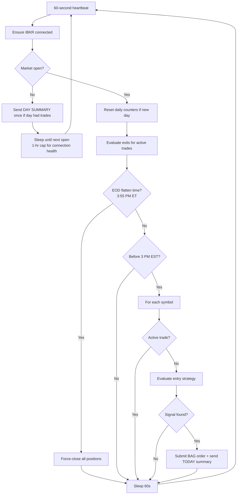
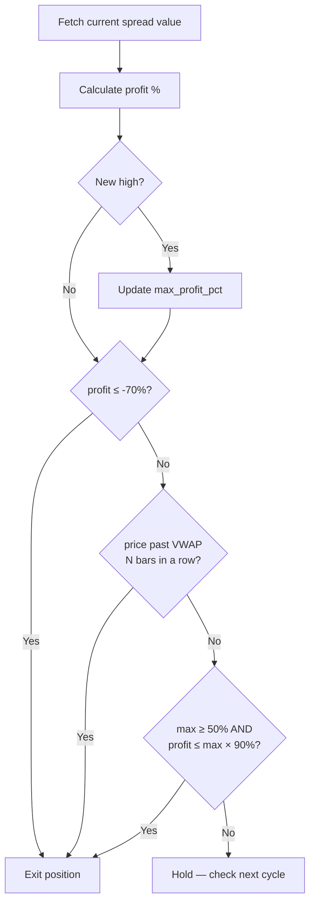

# How the 0DTE Trading Bot Works

This document explains the full lifecycle of the bot — from startup and market-hours management through entry scanning, order execution, position monitoring, and exit rules.

> Looking for the entry/exit/P&L rules organized **by trade structure** (CALL/PUT debit spread vs. iron condor, and why there's no standalone credit spread)? See [PLAYBOOKS.md](PLAYBOOKS.md). This document is the chronological lifecycle; that one is the structure-by-structure reference.

---

## 1. Startup

```bash
python src/main.py
```

The code is split by concern: `bot.py` holds state and orchestration only; `broker.py` owns all IBKR communication; `strategy.py` is pure signal math (dataframes in → decisions out, no I/O); `notifier.py` holds the Discord transport and every message template; `audit.py` writes the CSV; `market_time.py` answers all ET clock questions.

`main.py` first creates an asyncio event loop (required for Python 3.10+ compatibility with `ib_insync`), then instantiates `TradingBot`, which:

1. Connects to IBKR via IB Gateway or TWS using the host/port from `.env`
2. Sets the market data type from `IBKR_MARKET_DATA_TYPE` (default **1 = real-time**; the paper account inherits the live account's data subscriptions). Set to `3`/`4` for delayed data when running without subscriptions
3. Silences `ib_insync`'s internal error logger and subscribes to `errorEvent` to route IBKR messages itself — suppressing expected info codes (162, 2104, 2106, 10091, 10167, etc.) and surfacing real problems as `WARNING`
4. Subscribes to account positions (`reqPositions`) and **adopts orphaned positions**: any open 0DTE spread found in the account but not in bot state (a restart wipes `active_trades`) is reconstructed — entry price estimated from account `avgCost` — and managed by the normal exit rules and EOD flatten. A 🔁 Discord alert lists what was adopted; unpairable positions get a ⚠️ alert for manual review instead
5. Enters the main `while True:` loop

---

## 2. The Heartbeat Loop

The loop runs every **60 seconds** using `ib.sleep()` — not Python's `time.sleep`. The ib_insync version keeps the IBKR event loop alive during the wait, so order fills and market data callbacks are processed in real time.

**Fast exit watch:** the cadence drops to **15 seconds** (`FAST_POLL_SECONDS`) whenever an exit needs tight monitoring — a closing order is awaiting its fill, or an ACTIVE trade's profit has reached `FAST_POLL_ARM_PCT` (35%, approaching the +50% trail trigger). This fixes the sampling slippage where fast moves blew 10–16 points past exit thresholds between 60-second checks (2026-07-07 QQQ). Entry scanning and the VWAP-invalidation bar fetch stay on a ~60s/50s cadence regardless — only the spread-price checks speed up.

Each iteration:

```
ensure connected
│
├─ Market closed?
│   ├─ Day had trades & summary not sent yet? → send 📅 DAY SUMMARY (once)
│   └─ Calculate seconds to next 9:30 AM EST weekday open
│       ├─ > 1 hour away → sleep 1 hour (wake hourly to keep IBKR alive)
│       └─ ≤ 1 hour away → sleep exactly until open
│
├─ Reset daily counters if it's a new trading day
├─ Evaluate exit conditions for all active trades
├─ EOD flatten time (3:55 PM ET)? → force-close all open positions
│
└─ Entry window open? (before 3:00 PM EST)
    └─ For each symbol (SPY, QQQ, IWM):
        └─ No active trade? → evaluate entry strategy → execute (+ send 📋 TODAY) if signal found
```



---

## 3. Smart Sleep (Market Closed)

When the market is closed, the bot calculates the exact number of seconds until the next 9:30 AM EST weekday open, skipping weekends. It then:

- **If > 1 hour away:** sleeps 1 hour, logs the countdown, then recalculates. This keeps the IBKR socket alive overnight and over weekends without constant reconnections.
- **If ≤ 1 hour away:** sleeps exactly until open, so the bot is ready to scan from the first minute.

Example log output over a weekend:
```
Market closed. Next open in 63h 14m. Sleeping 1 hour.
Market closed. Next open in 62h 14m. Sleeping 1 hour.
...
Market opens in 47m 12s. Sleeping until open.
Daily trade count reset for 2026-05-26
```

---

## 4. Daily Reset

At the start of each new trading day, `check_and_reset_daily_trade_count()` resets:
- `daily_trade_count → 0`
- `signal_cooldowns → {}` (all cooldowns cleared)
- `consecutive_losses → 0`
- `circuit_breaker_tripped → False`

---

## 5. Phase 1: Entry Scanning

For each symbol with no active trade, the bot runs through these checks in order. Any failure returns early with no trade placed. Guards 1–8 can block the trade; Step 9 (breadth) is a logged annotation only.

### Guard 1: Circuit Breaker
If `circuit_breaker_tripped` is True (N consecutive losses today), skip all entries. No new trades until midnight.

### Guard 2: Daily Trade Cap
If `daily_trade_count >= MAX_TRADES_PER_DAY` (default 12), skip. This is a hard safety ceiling; on normal trending days it's never hit.

### Guard 3: Signal Cooldown
After any trade (entry submitted), the `(symbol, direction)` pair is locked for `SIGNAL_COOLDOWN_MINUTES` (default 30). This prevents immediate whipsaw re-entry while still allowing continuation trades once the cooldown expires.

**Example:** SPY PUT fires at 10:05. Bot exits at 10:22. SPY PUT is locked until 10:35. If SPY is still bearish at 10:36, the bot can re-enter.

**Invalidation throttle (stronger than the cooldown):** if the same (symbol, direction) suffers `MAX_INVALIDATIONS_PER_SIGNAL` (default 2) **losing** thesis-invalidation exits (worse than −10%) in one day, the market has proven that signal chop — it stands down **until tomorrow**, regardless of cooldown. A ⛔ Discord alert fires when the throttle trips. Profitable invalidation exits don't count toward the throttle (a signal that exits with profit wasn't proven wrong — 2026-07-08 IWM was stood down after two *winning* exits, which motivated the refinement), but **all** invalidations count toward the conviction-score penalty, which measures tape character rather than signal quality. (Original motivation 2026-07-06: four SPY CALL re-entries into the same failing grind, all invalidated.)

### Guard 4: One Trade Per Symbol
If a trade is already `PENDING_ENTRY` or `ACTIVE` for this symbol, skip.

### Guard 5: Fetch 1-Minute Bars

```python
ib.reqHistoricalData(contract, durationStr='1 D', barSizeSetting='1 min',
                     whatToShow='TRADES', useRTH=True)
```

After fetching, the bot:
1. **Filters to today's session only** (bars from 9:30 AM EST onward) — IBKR's `1 D` duration can include yesterday's bars
2. **Drops NaN rows** — delayed data sometimes backfills with empty rows before prices are available
3. Requires **at least 20 clean bars** before proceeding (ensures enough data for ADX warmup)

### Guard 6: Calculate Indicators

**VWAP** — Volume-Weighted Average Price from 9:30 AM EST. Reflects the institutional average cost basis for the day.

**ADX(14)** — Average Directional Index over 14 bars. A value > 25 indicates a strong directional trend. Below 25 = choppy, no trade.

**30-Minute ORB** — Opening Range Breakout. The high and low of the 9:30–10:00 AM EST window, anchored to fixed wall-clock time (not `df.index[0]`). This means restarting the bot mid-day still produces the correct morning range.

### Guard 7: Entry Signal (with chop guards)

| Signal | Conditions |
|--------|-----------|
| **CALL** | ADX > 25 **and rising** AND price > VWAP AND price > ORB High × (1 + buffer) |
| **PUT** | ADX > 25 **and rising** AND price < VWAP AND price < ORB Low × (1 − buffer) |

Two chop guards were added after the 2026-07-01 reversal day (see [RETROSPECTIVE.md](RETROSPECTIVE.md)):

- **ADX slope** — ADX must have *risen* over the last `ADX_SLOPE_BARS` (default 10) bars. On 07-01, ADX direction predicted all five outcomes: every hard-stop loser entered on flat/fading ADX. The level check alone passes on residual momentum. Fails open early in the session while the lookback bar is still NaN.
- **Breakout buffer** — the close must clear the ORB level by `ORB_BREAKOUT_BUFFER_PCT` (default 0.1%), not poke a cent above it. Filters the midday micro-poke false breakouts.

If neither condition is met, no trade. If a signal is found, the bot proceeds to Guard 8 (spread pricing), then fetches the breadth annotation before submitting.

### Guard 8: Spread Pricing

The bot fetches live bid/ask from IBKR for each option leg and computes:

```
spread_cost = mid(long_leg) − mid(short_leg)
```

If `spread_cost < MIN_SPREAD_COST` ($0.10 default), skip — the spread is too cheap to be liquid.

### Step 9: Breadth Annotation ($TICK / $VOLD)

After the primary signal passes all prior guards, the bot fetches NYSE market breadth data from IBKR and evaluates it against the trade direction. The result is **logged for analysis — it does not block the trade.**

| Breadth index | What it measures |
|---------------|-----------------|
| **$TICK** | NYSE upticks minus downticks across all stocks, updated each minute |
| **$VOLD** | NYSE up-volume minus down-volume — the "weight" behind the tick reading |

The bot looks at the **last 10 bars (~10 minutes)** of each index and evaluates:

**Confirms a CALL when:**
- VOLD slope > 0 — up-volume is expanding
- TICK printing higher lows in ≥ 60% of recent bar pairs — breadth is strengthening
- Average TICK > −200 — not predominantly negative

**Confirms a PUT when:**
- VOLD slope < 0 — up-volume is contracting
- TICK not making higher lows (< 60%) — breadth is weakening
- Average TICK < 200 — not predominantly positive

**Why it's a log, not a gate:** `$TICK` and `$VOLD` are NYSE indices and may not be available on IBKR's delayed data feed. They also reflect NYSE stocks only — not the full Nasdaq universe behind QQQ. Rather than risk false negatives on valid trades, the verdict is written to `audit.csv` as the `Breadth` column on every BUY row. After 30–50 paper trades, look at whether losing trades consistently had diverging breadth at entry — if so, promote it to a hard filter.

**Caching:** TICK and VOLD are market-wide, not per-symbol. A single 60-second cache is shared across all three symbols (at most two IBKR requests per loop). If data is unavailable, the annotation is left blank.

The breadth label (`✓ confirmed` or `✗ diverging`) also appears in the Discord ⏳ submission and 🟢 fill alerts.

### Fallback: The Credit Playbook (iron condor on proven range days)

If no directional signal fires, the same bar data is checked against the **condor signal** — the regime where the debit playbook structurally loses is exactly where premium selling earns:

| Condition | Threshold | Why |
|-----------|-----------|-----|
| Time window | 11:00–13:30 ET | The range must have proven itself; premium must remain |
| No trend | ADX < `CONDOR_MAX_ADX` (22) | Mutually exclusive with debit entries (ADX ≥ 25 rising) by construction |
| Proven chop | ≥ `CONDOR_MIN_VWAP_CROSSES` (8) VWAP crosses | The tape has demonstrated range behavior — the same counter that penalizes debit conviction |
| Geometry | Price mid-range; range ≥ 2 strikes wide; credit ≥ `MIN_CONDOR_CREDIT` | Strikes must exist outside the range and pay enough to be worth the risk |

**Structure:** short call just above the day high, short put just below the day low, wings `SPREAD_WIDTH` out — a 4-leg BAG defined as a positive-value package (**SELL to open** collects the credit, **BUY to close**). Sized by max loss: `(width − credit) × 100 × qty ≤ MAX_POSITION_SIZE`.

**Condor exits** reuse the shared machinery with inverted P&L sign (`profit = credit − current cost`):
- Resting **buy-back limit at 50% of credit** (`CONDOR_TP_PCT`), parked on fill — the mirror of the debit TP
- **Hard stop −70%** → buys back at 1.7× credit (tighter than the classic 2× rule)
- **Range-breach invalidation** — 2 consecutive 1-min closes beyond a short strike means the range thesis is dead; exit instead of riding toward max loss
- **Trailing stop and EOD flatten** apply unchanged

**Restart caveat:** adoption does *not* reconstruct condors — an underlying with legs in both rights triggers the ⚠️ manual-review alert instead (half-adopting a condor as a "vertical" would misread it). Avoid restarting with a condor open, or close it manually first.

### Execution: BAG Combo Order

IBKR represents multi-leg options as `BAG` contracts with `ComboLeg` objects:

```python
bag = Contract(secType='BAG', symbol='SPY', exchange='SMART', currency='USD')
bag.comboLegs = [
    ComboLeg(conId=long_call.conId, ratio=1, action='BUY'),
    ComboLeg(conId=short_call.conId, ratio=1, action='SELL'),
]
order = LimitOrder('BUY', qty, round(spread_cost, 2))
ibkr_trade = ib.placeOrder(bag, order)
```

Position sizing is **conviction-based**. Each entry is scored 0–5 (+1 each: ADX ≥ 30, ADX slope ≥ +3, another symbol leaning the same direction within 5 min, entry before 11:00 ET, ≤ 4 VWAP crosses today; −1 per invalidation exit already today). Scores below `MIN_CONVICTION_SCORE` (default 2) **don't trade at all** — LOW-tier trades ran 1W/5L and can't clear the per-contract fee floor. Above it, the score picks the budget tier — MEDIUM (2–3) = 1× `MAX_POSITION_SIZE`, HIGH (≥ 4) = 1.5×:

```
budget = MAX_POSITION_SIZE × tier_multiplier
qty    = floor(budget / (spread_cost × 100))
```

The full score breakdown (e.g. `HIGH 4/5 | ADX✓ slope✓ agree✓(QQQ) early✓ tape✗(6x)`) is logged, written to the `Conviction` column of `audit.csv`, and shown in the ⏳/🟢 Discord alerts — so every retro can check whether the score separates winners from losers.

**Immediately on submission**, a Discord ⏳ orange alert fires with the full order details (strikes, limit price, qty, indicators). This fires even if the order is later rejected by IBKR — so you always know the bot attempted an entry.

Right after that, a **📋 TODAY** snapshot is sent: every open position with live unrealized P&L (`IWM PUT  $0.41 → $0.45  +9.8%  (peak +24%)`), every trade already closed today with its realized P&L, and the running net. The open-position values are read from a per-trade cache refreshed each loop by `evaluate_exit_conditions_for_symbol()`, so the summary makes **no extra IBKR calls**.

---

## 6. Phase 2: Monitoring Active Trades

Every loop iteration, `evaluate_exit_conditions_for_symbol()` runs for each active trade.

### Position Reconciliation (runs first, for ACTIVE trades)

Before any exit logic, the bot reconciles each `ACTIVE` trade against your **real IBKR account** via `ib.positions()` (subscribed at connect with `reqPositions()`), checking **every leg** (all `leg_conids` — 2 for a vertical, 4 for a condor):

- **Any leg still held** → the position is open; proceed to exit rules.
- **All legs absent** → start a **180-second confirmation window**. Only if they stay absent the whole window is the position treated as **closed externally** (closed manually via Client Portal / mobile / TWS, or assigned): the bot cancels any resting order, drops it from `active_trades`, fires a ⚠️ alert, and records no P&L.

Four safeguards make a false drop — which once orphaned live positions (2026-07-09) — effectively impossible:
- **Fail-open on an empty feed** — an account holding an open 0DTE spread *always* shows ≥ 2 option legs, so an empty `positions()` list means the feed isn't populated, **not** that everything closed. This was the actual 07-09 bug.
- **Any-leg check** — one visible leg means open; a partial feed can't drop the trade.
- **Time-based confirmation (180 s)**, not loop-count — so 15-second fast-polling can't drop a live trade in 30 s.
- **90-second grace** after a fill, so a just-opened position isn't flagged before the feed catches up.

An **anti-cascade entry guard** complements this: the bot refuses to open a new position while the account holds untracked legs for that symbol — so even a wrongly-dropped position can't get a duplicate stacked on top (the mechanism behind the 07-09 25-lot IWM pileup). Every trade also carries its IBKR **`permId`**, written to the audit and used as the exact join key when reconciling against the account.

### Pending Entry Check

If status is `PENDING_ENTRY`, the bot checks the live IBKR trade object's `orderStatus.status`:

| IBKR Status | Action |
|-------------|--------|
| `Filled` | Record fill price, transition to `ACTIVE`, log BUY to `audit.csv`, send 🟢 Discord alert |
| `Cancelled` / `ApiCancelled` / `Inactive` | Remove from tracking (order was rejected or expired) |
| Anything else | Log and wait — check again next cycle |

### Active Trade: Exit Rules

Once `ACTIVE`, two exit layers operate:

#### Layer 0 — Resting Take-Profit Limit (order-driven, not loop-driven)

The moment the entry fills, a limit sell is parked at `entry × (1 + TAKE_PROFIT_TARGET_PCT)` (default +60%). It fills the instant the market touches it — between heartbeats, no sampling loss — and it sells **into strength** (resting limits get lifted, unlike loop exits that sell into falling prices). Rationale: the highest peak ever recorded is +64.6% and every winner peaked in the 48–65% band; a $1-wide spread only approaches +100%+ near expiry, so waiting for it means holding gamma risk for value that doesn't exist yet.

**Safety invariant:** every other exit path (invalidation, trail, hard stop, EOD flatten, external-close detection) **cancels the resting TP first** and checks whether it filled during the cancel race — a forgotten resting sell after a close would open a naked short spread. TP fills are booked through the same confirmed-fill path as everything else (actual price + commissions).

The loop then evaluates three rules in priority order:

#### Rule 1 — Hard Stop Loss (70%)
```
if profit_pct ≤ -0.70: EXIT
```
Exit immediately if the spread has lost 70% of its entry value. The catastrophic backstop.

#### Rule 2 — Thesis Invalidation (VWAP recross)
```
if price closed on the wrong side of VWAP for N consecutive bars: EXIT
```
The entry reason is "price beyond VWAP and the ORB level". If price closes back on the **wrong side of VWAP** for `VWAP_INVALIDATION_BARS` (default 3) consecutive 1-min bars — below VWAP for calls, above for puts — the reason for being in the trade is gone. Exit at the market instead of riding to −70%.

**Why:** on 2026-07-01 all three hard-stop losers were below VWAP *long* before −70% hit; this rule would have cut them near −20/−30% (~$350 saved). The N-bar requirement stops a single whipsaw bar from ejecting a good trade. Set `VWAP_INVALIDATION_BARS=0` to disable.

#### Rule 3 — Trailing Stop (arms only after +50% peak)
```
if max_profit_pct ≥ 0.50 AND profit_pct ≤ max_profit_pct × 0.90: EXIT
```
The winner-management rule. Below a +50% peak the position rides (protected by Rules 1–2). Once the peak crosses +50%, exit if profit falls to **90% of the peak** (gives back 10% *of* the peak). Because it only arms at +50%, its threshold is always ≥ +45% — it never closes at a loss.

**Example:** Spread peaks at +60%. Trailing threshold = +54% (60 × 0.90). If profit drops below +54%, sell.



### Closing a Position (fill-confirmed)

The bot submits a `LimitOrder('SELL', qty, current_spread_value)` on the same BAG contract used for entry and marks the trade **`PENDING_EXIT`**. Nothing is booked yet — P&L used to be recorded at the submission price, which the IBKR account statement showed drifting from reality.

Each loop, the pending exit is polled:

| Closing order status | Action |
|----------------------|--------|
| `Filled` | Book the trade from the **actual `avgFillPrice`** and the **IBKR-reported commissions** (entry + exit legs, via each fill's `commissionReport`) |
| `Cancelled` / `Inactive` | Record the IBKR error code, sweep any conflicting open orders on the underlying if it was error 201, then revert to `ACTIVE` so a retry can fire — but **gated**: attempts are spaced by a 30s cooldown and capped at 4 |
| Still pending after **3 minutes** | Reprice: amend the limit to the current spread value (same order, no cancel race) and keep waiting |

If a close is rejected **4 times**, the bot sets `close_failed`, fires a 🛑 **CLOSE FAILED** alert, and **stops auto-retrying** — the trade stays tracked (never orphaned), and you close it manually or it expires. This bounds the reject/retry loop that once fired every ~15 seconds (2026-07-09 error-201).

On the confirmed fill:
1. **Recorded for the day summary** — `closed_trades_today` (with commission)
2. **Invalidation throttle counter** updated (⛔ alert if the signal hits the limit)
3. **Circuit breaker counter** updated (🚨 alert at N consecutive losses); a winner resets it
4. **Discord 🔵 alert** — actual fill price, P&L, round-trip commissions, net after fees
5. **`audit.csv` SELL row** — fill price + `Commission` column
6. Symbol removed from `active_trades` → back to scanning next cycle

The end-of-day 📅 summary reports **gross P&L, total commissions, and net after fees** — the number that actually matters for the go-live gates.

---

## 7. End-of-Day Flatten & Day Summary

**Flatten (3:55 PM ET, configurable via `EOD_FLATTEN_TIME`).** 0DTE options must never be held into the 4:00 PM close. Once the flatten time is reached, `close_all_positions()` runs:
- **Active** positions → priced and closed via the normal `close_position()` path (so they still hit the audit log, the 🔵 alert, and `closed_trades_today`).
- **Pending** unfilled entry orders → cancelled outright.

New entries already stop at 3:00 PM, so nothing reopens after the flatten.

**Day summary (after the close).** On the first loop after `is_market_open()` flips false, if the day had any trades and the summary hasn't been sent yet, a single **📅 DAY SUMMARY** fires: total realized P&L, trade count, wins/losses, win rate, a per-trade breakdown, and circuit-breaker status. A `daily_summary_sent` flag prevents re-sending during the hourly overnight/weekend wake-ups; it clears on the next trading day's reset. No-trade days send nothing.

**Dashboard refresh (right after the summary).** The bot then runs `scripts/build_dashboard.py` as a subprocess (so a dashboard failure can never break the trading loop), regenerating `dashboard.xlsx` from `audit.csv` with the day's trades included.

---

## 8. Circuit Breaker

| Condition | Action |
|-----------|--------|
| N consecutive **losing** trades (default 5) | `circuit_breaker_tripped = True`; 🚨 Discord alert; no new entries for the rest of the day |
| Any **winning** trade between losses | `consecutive_losses` resets to 0 |
| Midnight | Full reset — bot can trade again next day |

The circuit breaker fires **at close**, not at submission — it only counts confirmed losing exits.

**Daily loss limit (the backstop beneath it):** once the day's realized P&L **net of commissions** breaches −`MAX_DAILY_LOSS` (default $400), all new entries stop until tomorrow and a 🛑 alert fires. It's checked on every confirmed exit fill. The circuit breaker needs *consecutive* losses; the loss limit catches interleaved-win bleed days too. Open positions remain managed by the exit rules and EOD flatten either way.

---

## 9. Configuration Reference

All values live in `.env` and are loaded by `src/config.py`.

| Variable | Default | Description |
|----------|---------|-------------|
| `IBKR_HOST` | `127.0.0.1` | IB Gateway / TWS host |
| `IBKR_PORT` | `4002` | `4002` = IB Gateway paper, `7497` = TWS paper |
| `IBKR_CLIENT_ID` | `1` | Unique socket client ID; change if running multiple bots |
| `IBKR_MARKET_DATA_TYPE` | `1` | 1 = real-time (needs subscriptions), 3/4 = delayed |
| `SYMBOLS` | `SPY,QQQ,IWM` | Comma-separated underlyings to scan |
| `MAX_POSITION_SIZE` | `300.0` | Max dollars risked per spread |
| `MAX_TRADES_PER_DAY` | `12` | Hard daily cap across all symbols |
| `SIGNAL_COOLDOWN_MINUTES` | `30` | Minutes before a (symbol, direction) signal can re-trigger |
| `MIN_SPREAD_COST` | `0.10` | Skip trade if spread mid-price is below this |
| `ADX_SLOPE_BARS` | `10` | Entry chop guard: ADX must be rising over this many bars (0 = off) |
| `ORB_BREAKOUT_BUFFER_PCT` | `0.001` | Entry chop guard: breakout must clear the ORB level by this fraction (0 = off) |
| `VWAP_INVALIDATION_BARS` | `3` | Exit: leave the trade if price closes past VWAP this many bars in a row (0 = off) |
| `MAX_INVALIDATIONS_PER_SIGNAL` | `2` | Stand down a (symbol, direction) after this many invalidation exits in a day (0 = off) |
| `FAST_POLL_SECONDS` | `15` | Loop cadence while an exit needs tight watching (0 = always 60s) |
| `FAST_POLL_ARM_PCT` | `0.35` | Profit level that switches the loop to fast polling |
| `CONVICTION_SIZING_ENABLED` | `true` | Score entries 0–5 and size the position budget by tier |
| `CONVICTION_LOW_MULT` | `0.5` | Budget multiplier for LOW conviction (score ≤ 1) |
| `CONVICTION_HIGH_MULT` | `1.5` | Budget multiplier for HIGH conviction (score ≥ 4) |
| `MIN_CONVICTION_SCORE` | `2` | Skip entries scoring below this (−99 to disable) |
| `TAKE_PROFIT_TARGET_PCT` | `0.60` | Resting limit sell at entry × (1 + this), parked on fill (0 = off) |
| `CONDOR_ENABLED` | `true` | Sell iron condors on proven range days (11:00–13:30 ET) |
| `CONDOR_MAX_ADX` | `22` | Condor requires ADX below this (no trend) |
| `CONDOR_MIN_VWAP_CROSSES` | `8` | Condor requires at least this many VWAP crosses (proven chop) |
| `MIN_CONDOR_CREDIT` | `0.15` | Skip condors collecting less than this |
| `CONDOR_TP_PCT` | `0.50` | Resting buy-back at this fraction of credit received |
| `TAKE_PROFIT_TRAIL_TRIGGER` | `0.50` | Peak profit % that arms the trailing stop |
| `TRAILING_STOP_LOSS_PCT` | `0.10` | Once armed, exit if profit falls to (1 − this) of the peak — i.e. gives back 10% of the peak |
| `HARD_STOP_LOSS_PCT` | `0.70` | Exit immediately if spread loses this fraction of entry value |
| `MAX_CONSECUTIVE_LOSSES` | `5` | Circuit breaker threshold |
| `MAX_DAILY_LOSS` | `400` | Stop new entries once the day's realized net P&L ≤ −this (0 = off) |
| `EOD_FLATTEN_TIME` | `15:55` | ET time to force-close all positions before the 4 PM close |
| `DISCORD_WEBHOOK_URL` | _(empty)_ | Discord webhook for trade alerts |

---

## 10. Audit Log Analysis

Every fill is written to `audit.csv`. Some useful queries:

**Win rate and average P&L by symbol:**
```python
import pandas as pd
df = pd.read_csv('audit.csv')
sells = df[df['Action'] == 'SELL'].copy()
sells['Profit_Pct'] = sells['Profit_Pct'].str.replace('%','').astype(float)
print(sells.groupby('Symbol')['Profit_Pct'].agg(['mean', 'count', lambda x: (x > 0).mean()]).rename(columns={'<lambda_0>': 'win_rate'}))
```

**Which exit rule fires most often:**
```python
print(sells['Reason'].value_counts())
```

**Performance by ADX level at entry:**
```python
buys = df[df['Action'] == 'BUY'].copy()
buys['ADX'] = buys['ADX'].astype(float)
print(buys.groupby(pd.cut(buys['ADX'], bins=[25, 30, 35, 40, 100]))['Symbol'].count())
```

**Check if circuit breaker is being hit too often** (signals overly choppy days):
```python
print(sells[sells['Reason'].str.contains('Hard stop')].shape[0], 'hard stops vs', sells.shape[0], 'total exits')
```
