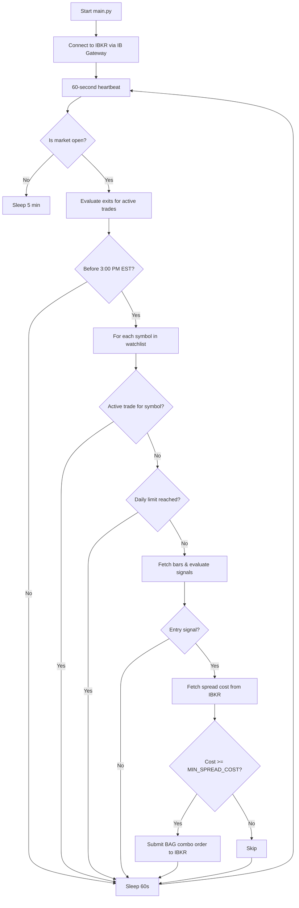
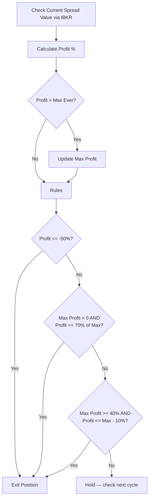
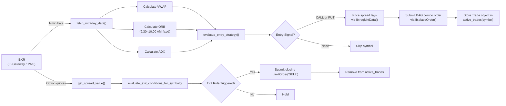

# How the 0DTE Trading Bot Works in Real-Time

This document explains the lifecycle of the `TradingBot` script — how it runs continuously, evaluates charts, places option spread orders via IBKR, and manages risk dynamically.

---

## 1. The Continuous Loop (The Heartbeat)

When you run `python src/main.py`, the script:
1. Creates an event loop (required for Python 3.10+ compatibility with `ib_insync`)
2. Initializes the `TradingBot`, which connects to IBKR via IB Gateway or TWS
3. Enters an infinite `while True:` loop

The loop fires every **60 seconds** using `ib.sleep(60)` (not `time.sleep` — the ib_insync version keeps the IBKR event loop alive so order fills and market data updates are received continuously).

Each iteration either:
- **Scans for entry signals** (if no active trade for that symbol), or
- **Monitors the active position** (if a trade is open)



---

## 2. IBKR Connection

The bot uses `ib_insync` to communicate with IBKR. This requires IB Gateway (or TWS) to be running locally with API access enabled.

**Connection settings (from `.env`):**

| Setting | Default | Description |
|---|---|---|
| `IBKR_HOST` | `127.0.0.1` | IB Gateway host |
| `IBKR_PORT` | `4002` | IB Gateway paper port (TWS paper uses `7497`) |
| `IBKR_CLIENT_ID` | `1` | Unique client ID for this connection |

On startup, the bot also calls `ib.reqMarketDataType(4)` to request delayed data. This means no live data subscription is needed for paper trading — IBKR will serve the most recently available delayed quotes.

If the connection drops during a session, `_ensure_connected()` is called at the start of each loop iteration to reconnect automatically.

---

## 3. Phase 1: Scanning for Entries

If the bot has no active trade for a symbol, it enters the **Scanning Phase**.

### Step 1: Market Hours Check
The bot checks if the current time is within regular trading hours (Mon–Fri, 9:30 AM – 4:00 PM EST). If not, it sleeps for 5 minutes.

### Step 2: Entry Window Check
Before fetching any data, the bot checks if it is past **3:00 PM EST**. If so, it skips all entry logic for the rest of the day — 0DTE spreads entered late carry unmanageable theta risk.

### Step 3: Daily Trade Limit Check
Checks if the day's trade count has reached `MAX_TRADES_PER_DAY` (default: 5). The counter resets at midnight after the trading day. If the limit is hit, no new entries for the day.

### Step 4: Fetch 1-Minute Bars from IBKR

```
ib.reqHistoricalData(contract, durationStr='1 D', barSizeSetting='1 min', ...)
```

- For **SPY/QQQ**: uses `whatToShow='TRADES'` (ETFs with real volume)
- For **SPX**: uses `whatToShow='MIDPOINT'` because SPX is a cash index with no tradeable volume; a dummy `volume=1` is injected so VWAP calculation doesn't break

### Step 5: Calculate Technical Indicators

#### VWAP (Volume-Weighted Average Price)
Institutional average cost from market open. Used to determine whether price is trading above or below fair value.

#### 30-Minute Opening Range Breakout (ORB)
The ORB window is anchored to **9:30 AM EST wall-clock time**, not the first bar in the returned dataset. This ensures the breakout range is always correctly identified even if the bot restarts mid-day.

```
ORB window: 9:30 AM – 10:00 AM EST
ORB High = max high in that window
ORB Low  = min low in that window
```

#### ADX (Average Directional Index)
Trend strength over a 14-bar window. Must exceed 25 before any entry is considered.

### Step 6: Evaluate Entry Signal

**CALL signal (bullish):**
- ADX > 25
- Price > VWAP
- Price > ORB High

**PUT signal (bearish):**
- ADX > 25
- Price < VWAP
- Price < ORB Low

### Step 7: Price the Spread from IBKR

The bot fetches real bid/ask data for each option leg via `ib.reqMktData()`. The mid-price of each leg is calculated as `(bid + ask) / 2`. Spread cost = `long_mid - short_mid`.

**Symbol mapping:**
- SPY/QQQ options: use the ETF ticker directly
- SPX options: use `SPXW` (weekly expiry series) — the bot maps this automatically

If the spread cost is below `MIN_SPREAD_COST` ($0.10 by default), the trade is skipped.

### Step 8: Submit BAG Combo Order

IBKR represents multi-leg options orders as `BAG` contracts with `ComboLeg` objects. The bot submits a limit order at the mid-price:

```python
bag = Contract(symbol='SPY', secType='BAG', currency='USD', exchange='SMART')
bag.comboLegs = [
    ComboLeg(conId=long_call.conId, ratio=1, action='BUY', exchange='SMART'),
    ComboLeg(conId=short_call.conId, ratio=1, action='SELL', exchange='SMART'),
]
order = LimitOrder('BUY', qty, limit_price)
ib.placeOrder(bag, order)
```

The trade object returned by `ib.placeOrder()` is stored in `active_trades` and updated in-place by ib_insync as the order status changes.

---

## 4. Phase 2: Monitoring and Exiting

Once an order is placed, the bot tracks it as `PENDING_ENTRY`. Each subsequent loop iteration checks the `Trade` object's status via `ibkr_trade.orderStatus.status`.

When status becomes `'Filled'`:
- Entry price is set from `avgFillPrice`
- Status transitions to `'ACTIVE'`
- BUY row is written to `audit.csv`
- Discord alert fires

### Exit Rules

Every loop iteration evaluates three exit rules in priority order:

#### Rule 1: Hard Stop Loss (50%)
Exit immediately if the spread has lost 50% or more of its entry value. Prevents catastrophic losses.

```
if profit_pct <= -0.50: EXIT
```

#### Rule 2: Max Profit Trailing Exit (70% of peak)
The bot tracks the highest profit percentage ever seen for this trade. If current profit drops to 70% of that peak, exit.

Example:
- Entry: $1.00 → spread reaches $1.50 (+50% max)
- Exit threshold: 70% of +50% = +35%
- If spread drops back to $1.35, SELL

```
if max_profit > 0 and profit <= max_profit * 0.70: EXIT
```

#### Rule 3: 10% Trailing Stop (activated at 40% profit)
Once profit reaches 40%, a trailing stop locks in gains: exit if profit ever drops 10% below the peak.

Example:
- Profit reaches +55% (max)
- Trailing stop: +55% - 10% = +45%
- If profit drops to +45% or below, SELL

```
if max_profit >= 0.40 and profit <= max_profit - 0.10: EXIT
```



### Closing the Position

The bot submits a `LimitOrder('SELL', qty, current_spread_value)` on the same BAG contract used for entry. IBKR interprets this as closing the spread.

After submitting the closing order:
- SELL row is written to `audit.csv` with exit-time indicators
- Discord alert fires with P&L summary
- Symbol is removed from `active_trades` and goes back to scanning mode

---

## 5. Data Flow



---

## 6. Configuration Reference

All settings live in `.env` and are loaded by `src/config.py`.

| Variable | Default | Description |
|---|---|---|
| `IBKR_HOST` | `127.0.0.1` | IB Gateway / TWS host |
| `IBKR_PORT` | `4002` | `4002` = IB Gateway paper, `7497` = TWS paper |
| `IBKR_CLIENT_ID` | `1` | Unique socket client ID |
| `SYMBOLS` | `SPY,SPX` | Comma-separated underlyings to trade |
| `MAX_POSITION_SIZE` | `200.0` | Max dollars per spread (determines contract qty) |
| `MAX_TRADES_PER_DAY` | `5` | Max new entries per day |
| `MIN_SPREAD_COST` | `0.10` | Skip trade if spread costs less than this |
| `TAKE_PROFIT_TRAIL_TRIGGER` | `0.40` | Profit level that activates the trailing stop |
| `TRAILING_STOP_LOSS_PCT` | `0.10` | Trail amount once trigger is hit |
| `MAX_PROFIT_EXIT_MULTIPLIER` | `0.70` | Exit when profit drops to this fraction of peak |
| `HARD_STOP_LOSS_PCT` | `0.50` | Hard stop — exit if spread loses this much |
| `DISCORD_WEBHOOK_URL` | _(empty)_ | Optional Discord webhook for trade alerts |

---

## 7. Audit Log Analysis

Every trade is logged to `audit.csv`. Use it to tune the strategy:

**Which ADX levels produce winners?**
```python
import pandas as pd
df = pd.read_csv('audit.csv')
buys = df[df['Action'] == 'BUY'].copy()
buys['ADX'] = buys['ADX'].astype(float)
print(buys.groupby(pd.cut(buys['ADX'], bins=[25,30,35,40,100]))['Symbol'].count())
```

**Win rate by direction:**
```python
sells = df[df['Action'] == 'SELL'].copy()
sells['Profit_Pct'] = sells['Profit_Pct'].str.replace('%','').astype(float)
print(sells.groupby('Direction')['Profit_Pct'].agg(['mean', 'count']))
```

**Most common exit reason:**
```python
print(sells['Reason'].value_counts())
```
