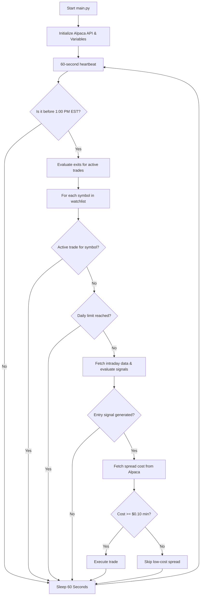
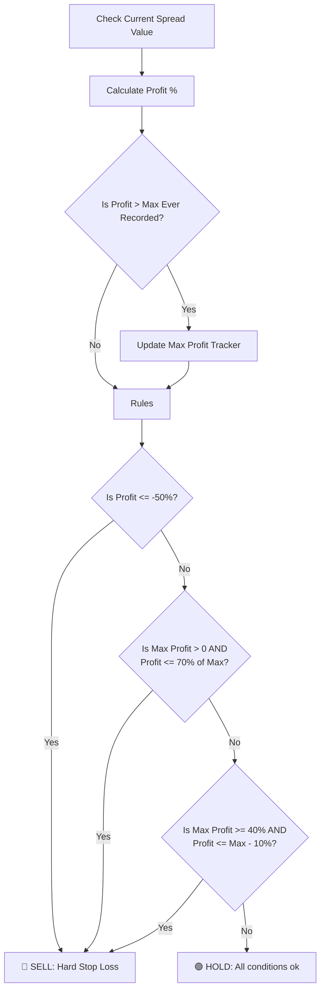
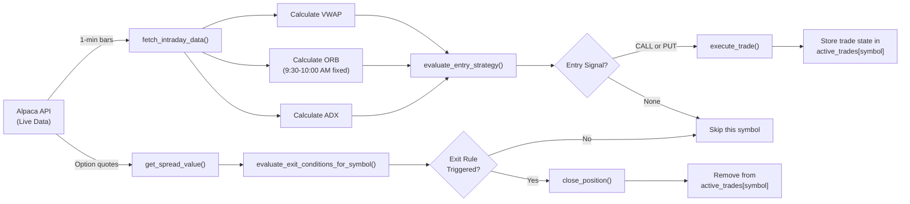

# How the 0DTE Trading Bot Works in Real-Time

This document explains the lifecycle of the `TradingBot` script, detailing how it runs continuously, evaluates charts, buys options spreads, and manages risk dynamically.

---

## 1. The Continuous Loop (The Heartbeat)

When you run `python src/main.py`, the script initializes the `TradingBot` object, connects to the Alpaca Paper API, and enters an infinite `while True:` loop.

Think of this loop as the bot's "heartbeat." 
- Every **60 seconds**, the heartbeat triggers an action.
- For each symbol in your watchlist, it either:
  - **Scans for entry signals** (if no active trade for that symbol), or
  - **Monitors the active position** (if a trade is already open for that symbol)

The key improvement is **per-symbol concurrency**: You can have one active trade per symbol simultaneously. For example, you could be long SPY calls while simultaneously short SPX puts.



---

## 2. Phase 1: Scanning for Entries (No Active Trade Per Symbol)

If the bot has no active trade for a given symbol, it enters the **Scanning Phase**.

### Step 1: Time-of-Day Filter (Early Check)
**Critical:** Before fetching any intraday data, the bot checks if it is past 1:00 PM EST. If so, it skips the entire entry phase for the remaining day.

**Why check early?** This prevents unnecessary Alpaca API calls for market data after the cutoff. 0DTE spreads decay rapidly in the final hours, and entering after 1 PM exposes the trade to unmanageable theta risk. The bot enforces a hard cutoff at 1:00 PM to avoid chasing time decay in unfavorable conditions.

### Step 2: Fetch Live Intraday Data
The bot asks Alpaca for all 1-minute candlesticks from 9:30 AM EST up to the current minute.

### Step 3: Daily Trade Limit Check
Before evaluating signals, the bot checks if it has already reached the daily trade limit (default: 5 trades per day). The counter resets at market open (9:30 AM EST each day).

**Why?** On choppy, range-bound days, the bot can generate many false signals and churn through trades without profit. A daily limit protects capital by forcing the bot to be selective and prevents over-trading during low-conviction periods. Real traders don't enter dozens of trades per day on 0DTE spreads—they limit exposure and wait for the highest-confidence setups.

**Example:**
- Day 1: Bot executes 5 trades, limit reached. No new entries for rest of day.
- Day 2 (9:30 AM): Counter resets. Bot can execute up to 5 more trades.

### Step 4: Calculate Technical Indicators
The bot calculates:

#### VWAP (Volume-Weighted Average Price)
Determines the institutional average cost from market open. Used to gauge whether the market is trading above or below fair value.

#### 30-Minute Opening Range Breakout (ORB)
**Key Fix:** The ORB window is anchored to **fixed 9:30 AM EST wall-clock time**, not the first bar in the dataset.

This is critical for resilience: If the bot restarts mid-day (e.g., 2:00 PM), the ORB will still correctly identify breakouts from the morning range (9:30 AM - 10:00 AM), not some arbitrary starting point. Without this fix, restarting the bot would invalidate all ORB signals.

```
Market Open: 9:30 AM
ORB Calculation Window: 9:30 AM - 10:00 AM (first 30 minutes)
ORB High = highest high in this window
ORB Low = lowest low in this window
```

#### ADX (Average Directional Index)
Measures trend strength. A value > 25 indicates a strong directional trend (bullish or bearish). The bot requires ADX > 25 before placing any trade.

### Step 4: Evaluate Entry Signals
The bot checks two conditions:

**CALL Signal (Bullish):**
- ADX > 25 (strong uptrend)
- Price > VWAP (trading above institutional cost)
- Price > ORB High (breaking out above morning range)

**PUT Signal (Bearish):**
- ADX > 25 (strong downtrend)
- Price < VWAP (trading below institutional cost)
- Price < ORB Low (breaking out below morning range)

### Step 5: Fetch Spread Cost and Check Minimum Threshold
If a signal is generated:
1. Fetch the current underlying price
2. Calculate ATM (At-The-Money) and OTM (Out-Of-The-Money) strike prices
3. **Fetch actual option bid/ask prices from Alpaca's options data API** to determine the real spread cost (not simulated)
4. **Check minimum spread cost:** If spread cost < $0.10 (configurable), skip the trade. Low-cost spreads have almost no premium and likely indicate poor liquidity.
5. If valid, calculate how many spreads you can afford under your max position size

### Step 6: Execution
Execute the trade and record it to audit.csv

---

## 3. Phase 2: Monitoring and Selling (Trade is Active for a Symbol)

Once a trade is opened for a symbol, the bot stops scanning for new entries for *that symbol* and shifts to **Monitoring Mode**.

Every 60 seconds, the bot:
1. Fetches the current option bid/ask prices for both legs of the spread
2. Calculates the current spread value (midpoint of bid/ask)
3. Compares it to the entry price to determine `profit_pct`
4. Tracks the highest profit achieved (`max_profit_pct`)
5. Evaluates three exit rules to decide whether to sell

### Exit Rules

#### Rule #1: Hard Stop Loss (50%)
If the spread value drops to 50% below entry price or lower, **SELL immediately**.

**Example:** You bought a spread for $1.00. If it falls to $0.50 or less, the bot exits.

#### Rule #2: Max Profit Exit (70% Trail)
The bot remembers the highest profit achieved. If profit drops to 70% of that peak, **SELL**.

**Example:** 
- You bought at $1.00, profit reaches +50% ($1.50)
- Max profit = +50%
- Exit threshold = 70% of max = +35%
- If profit falls to +35% or below, SELL

#### Rule #3: 10% Trailing Stop (Triggered at 40% Profit)
If the profit reaches 40% or higher, a 10% trailing stop activates.

**Example:**
- Profit reaches +50%
- Trailing stop is set at +40% (50% - 10%)
- If profit drops to +40% or below, SELL (lock in gains)



---

## 4. Resetting

Once the bot exits a trade via any rule, it removes that symbol from the active trades dictionary. The very next 60-second cycle:
- That symbol goes back to **Phase 1** (scanning for entries)
- Other symbols with active trades continue in **Phase 2** (monitoring)

---

## 5. Data Flow



---

## 6. Why These Design Decisions?

### Daily Trade Limit (Max 5 Trades Per Day)
Early versions had no daily trade limit. On choppy, oscillating days, the bot would generate dozens of whipsaw signals and churn through trades—opening and closing positions every few minutes without profit. This burns capital on commissions and slippage.

The 5-trade daily limit ensures:
- **Quality over Quantity:** The bot is forced to wait for high-conviction setups
- **Backtesting Realism:** Real traders don't scalp 0DTE spreads 20+ times per day
- **Capital Preservation:** Prevents capital bleed during unfavorable market conditions
- **Resiliency:** If the bot is generating whipsaws, it stops trading and waits for tomorrow

The counter resets at 9:30 AM EST daily, aligning with market open.

### Minimum Spread Cost Floor ($0.10)
Originally, the bot would enter any trade if a signal was generated and the cost was > $0.00. However, spreads with nearly zero premium (e.g., $0.02–$0.05) indicate:
- Poor liquidity (wide bid-ask spreads)
- Almost no theta decay profit potential
- High risk of slippage when exiting

The **minimum spread cost floor** (default: $0.10, configurable via `MIN_SPREAD_COST`) ensures:
- **Liquidity:** Only trade spreads with meaningful bid-ask volumes
- **Realistic Profit Potential:** Avoid chasing pennies in illiquid contracts
- **Risk/Reward:** Respects the hard realities of option contract liquidity

Example:
- Spread signals a bullish CALL, but the 5-wide spread costs only $0.03 → Skipped (below $0.10 floor)
- Spread signals a bearish PUT, and the 5-wide spread costs $0.15 → Executed

### Fixed 9:30 AM for ORB (Not df.index[0])
Early versions used `df.index[0]` (the first bar returned by the API) to anchor the ORB window. This broke if the bot restarted mid-day, because the API would return bars starting from 9:30 AM, but `df.index[0]` might be 2:00 PM. The fix ensures ORB always references the true market open at 9:30 AM EST.

### 1:00 PM EST Entry Cutoff
0DTE options have massive gamma and theta risk. In the final 2-3 hours before expiration:
- A $0.05 move in the underlying can swing a spread by $0.50+
- Theta decay accelerates exponentially
- Bid/ask spreads widen
- Liquidity dries up

The 1:00 PM cutoff prevents the bot from entering risky late-day positions where adverse moves can cascade into losses.

### Per-Symbol Concurrency
Allows diversification across multiple underlyings without excessive correlation risk. You can have directional exposure to both broad market (SPY) and volatility (VIX) trades simultaneously.

### Real Option Prices (Not Simulated)
The bot fetches actual bid/ask quotes from Alpaca for both legs of the spread. This ensures:
- Accurate spread cost calculations
- Real exit prices that reflect market conditions
- No false signals based on simulated data

---

## 7. Audit Logging and Strategy Analysis

Every trade (entry and exit) is logged to `audit.csv` with complete indicator context. This is critical for understanding your strategy's performance.

### Log Columns

| Column | Purpose |
|--------|---------|
| **Timestamp** | When the trade executed |
| **Action** | BUY or SELL |
| **Symbol** | SPY, SPX, etc. |
| **Direction** | CALL or PUT |
| **Price** | Spread entry/exit price |
| **Underlying_Price** | Spot price at trade time |
| **ADX** | Trend strength (0-100, >25 is strong) |
| **VWAP** | Volume-weighted average price |
| **ORB_High** | 30-min opening range high |
| **ORB_Low** | 30-min opening range low |
| **Reason** | Why the trade was entered or exited |

### Example Audit Log

```
Timestamp,Action,Symbol,Direction,Price,Underlying_Price,ADX,VWAP,ORB_High,ORB_Low,Reason
2025-05-03 10:15:00,BUY,SPY,CALL,0.65,450.25,35.42,450.10,449.50,448.75,Bullish: Price (450.25) > VWAP (450.10) and ORB High (449.50). ADX: 35.42
2025-05-03 10:22:00,SELL,SPY,CALL,0.95,451.10,38.15,450.80,449.50,448.75,Dropped to 70% of Max Profit. (Max: 46%, Current: 32%)
```

### Strategy Tuning with Audit Logs

Use the audit log to answer critical questions:

**Which ADX levels produce winners?**
- Filter trades by ADX value and analyze win rate
- Example: Do trades with ADX > 40 have higher win rates than ADX 25-30?

**How does the spread of price vs. VWAP affect outcomes?**
- Analyze profit/loss by distance between entry price and VWAP
- Do wider breakouts outperform? Do entries near VWAP tend to whipsaw?

**Are ORB breakouts predictive?**
- Compare the distance broken (price vs. ORB high/low) to trade duration and profit
- Does breaking far out of the range correlate with directional follow-through?

**When do exits trigger?**
- Review the reasons in SELL rows to see which exit rule fires most often
- Example: Are you hitting the 50% hard stop loss frequently? This might mean entry ADX is too low.

**Market condition analysis:**
- Cross-reference trade times and indicators with broader market conditions
- Did the bot trade well during certain volatility regimes (high ADX) vs. choppy markets (low ADX)?

### Python Example: Analyzing Audit Logs

```python
import pandas as pd

# Load audit log
audit = pd.read_csv('audit.csv')

# Filter to BUY entries only
entries = audit[audit['Action'] == 'BUY']

# Analyze win rate by ADX level
adx_high = entries[entries['ADX'] > 35]
print(f"Win rate (ADX > 35): {adx_high[...]}")  # Compare subsequent SELL price to entry price

# Analyze profit by breakout distance
audit['breakout_distance'] = abs(audit['Underlying_Price'] - 
                                 ((audit['ORB_High'] + audit['ORB_Low']) / 2))

# Correlate breakout distance with trade outcome
# (requires joining BUY and SELL rows)
```

This data-driven approach to reviewing trades is essential for iterating on the strategy.
