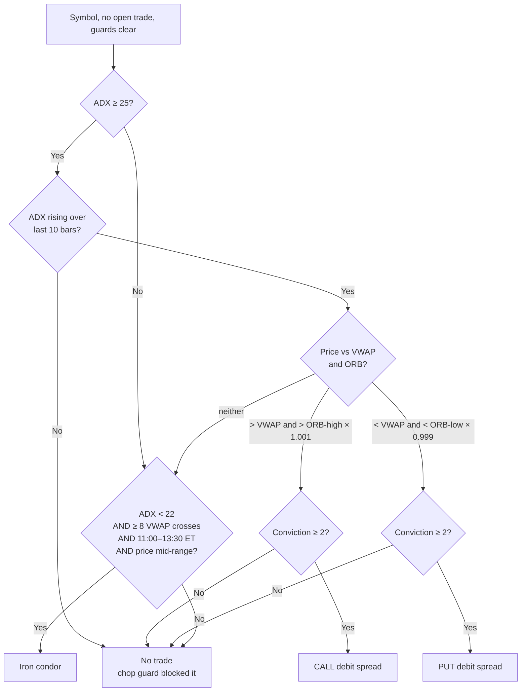

# Trade Playbooks — Entry, Exit & P&L by Structure

A structure-by-structure reference for **why** the bot picks a given trade and **how** it closes and books it. For the full loop lifecycle see [HOW_IT_WORKS.md](HOW_IT_WORKS.md); for the evidence behind the rules see [RETROSPECTIVE.md](RETROSPECTIVE.md).

The bot runs exactly **two structures**, matched to two market regimes:

| Regime | Structure | Bias |
|--------|-----------|------|
| **Trending** | CALL or PUT **debit** vertical | Directional (long premium) |
| **Range-bound / chop** | **Iron condor** | Neutral (short premium) |

> **There is no standalone directional credit spread** (a lone call-credit or put-credit spread). See [§4](#4-why-no-standalone-credit-spreads) for the reasoning.

---

## 1. Structure Selection — the entry decision

Every 60-second scan, for each symbol with no open position (before 3:00 PM ET, with all risk guards clear), the bot fetches 1-min bars and computes **VWAP**, **ADX(14)**, and the **30-min ORB**. Then:

**The regimes are mutually exclusive by construction:** the debit side needs a trend (`ADX ≥ 25` **and rising**); the condor side needs its absence (`ADX < 22`). The **22–25 ADX band is a deliberate no-trade zone** — neither a confirmed trend nor confirmed chop.

### Shared gates (apply to every structure, checked before entry)

| Gate | Rule |
|------|------|
| Market hours | 9:30 AM–4:00 PM ET, weekdays |
| Entry window | Before 3:00 PM ET |
| Warmup | ≥ 30 one-minute bars (ADX needs ~29) |
| One per symbol | No second position in the same underlying |
| Cooldown | `(symbol, direction)` locked `SIGNAL_COOLDOWN_MINUTES` (30) after a trade |
| Circuit breaker | Halts entries after `MAX_CONSECUTIVE_LOSSES` (5) in a row |
| Daily loss limit | Halts entries once realized net P&L ≤ −`MAX_DAILY_LOSS` ($400) |
| Daily trade cap | `MAX_TRADES_PER_DAY` (12) |

---

## 2. CALL / PUT Debit Spreads (the trend playbook)

A near-the-money vertical bought for a **debit** — you pay premium, profit if the underlying moves your way. Defined risk (the debit paid), defined-ish reward.

### Entry criteria

A **CALL debit spread** (buy ATM call, sell 1-strike-higher call) fires when **all** hold:

| # | Condition | Config | Why |
|---|-----------|--------|-----|
| 1 | ADX > 25 | — | A trend exists |
| 2 | ADX **rising** over last N bars | `ADX_SLOPE_BARS=10` | The trend is *alive*, not residual (07-01: fading ADX predicted every loser) |
| 3 | Price > VWAP | — | Above the institutional average → bullish control |
| 4 | Price > ORB-High × (1 + buffer) | `ORB_BREAKOUT_BUFFER_PCT=0.001` | A real breakout, not a 1-cent poke |
| 5 | Conviction score ≥ minimum | `MIN_CONVICTION_SCORE=2` | Skip low-odds setups that can't clear fees |

A **PUT debit spread** (buy ATM put, sell 1-strike-lower put) is the exact mirror: price **< VWAP** and **< ORB-Low × (1 − buffer)**.

**Conviction sizing** — score 0–5 (+1 each: ADX ≥ 30, ADX slope ≥ +3, another symbol agreeing, entry before 11:00 ET, ≤ 4 VWAP crosses; −1 per invalidation exit already today) sets the budget:

| Score | Tier | Budget (`MAX_POSITION_SIZE=300`) |
|-------|------|----------------------------------|
| ≤ 1 | LOW | **Skip — no trade** |
| 2–3 | MEDIUM | $300 (1.0×) |
| ≥ 4 | HIGH | $450 (1.5×) |

`contracts = floor(budget ÷ (debit × 100))`

### Exit criteria — how the position is closed

Checked in priority order; the resting take-profit is an actual order that can fill any time between checks:

| Priority | Exit | Trigger | Rationale |
|----------|------|---------|-----------|
| **0 — resting** | **Take-profit** | Limit sell parked at **entry × 1.60** the instant the entry fills | Max peak ever seen is +64.6%; a $1 spread only nears +100% at expiry. Fills between heartbeats, sells *into* strength |
| **1** | **Hard stop** | Spread value ≤ 30% of entry (−70%) | Catastrophic backstop |
| **2** | **Thesis invalidation** | Price closes on the wrong side of VWAP for `VWAP_INVALIDATION_BARS=3` consecutive bars | The reason you entered (price beyond VWAP + ORB) is gone — leave near −20/−30% instead of riding to −70% |
| **3** | **Trailing stop** | After peak ≥ +50%, exit if profit falls to 90% of peak | Locks in a runner that never hit the +60% target |
| **loop** | **EOD flatten** | 3:55 PM ET (`EOD_FLATTEN_TIME`) | Never hold 0DTE into expiry |

Also: a **losing** invalidation (< −10%) increments the throttle — after 2 on the same signal in a day, that signal stands down until tomorrow.

### Profit / loss booking

- **Entry** at debit `D`, quantity `N`: cash out = `D × N × 100`
- **Exit** at value `E` (the actual IBKR **fill price**, confirmed via `PENDING_EXIT` — never the submission price)
- **P&L $** = `(E − D) × N × 100`   ·   **P&L %** = `(E − D) ÷ D`
- **Commissions** read from IBKR's `commissionReport` (both legs, entry + exit); the day summary and dashboard report **net after fees**
- **Max theoretical loss** = `D × N × 100` (spread expires worthless) — but the hard stop caps realized loss near −70%

**Worked example (real, 2026-06-30):** QQQ CALL, entry `D=$0.44`, `N=6`. Exit at `E=$0.66` (trail). P&L = `(0.66 − 0.44) × 6 × 100 = +$132`, +50.0%. Fees ~$5 → net ~+$127.

---

## 3. Iron Condors (the chop playbook)

Four legs: **sell** a call spread above the market **and** a put spread below it, collecting a **credit**. You profit if the underlying stays *between* the short strikes — the structure that earns on the range days where the debit playbook can only lose less.

### Entry criteria

Evaluated only when **no directional signal fired**. All must hold:

| # | Condition | Config | Why |
|---|-----------|--------|-----|
| 1 | Time is 11:00–13:30 ET | — | The range must have proven itself; premium must remain |
| 2 | ADX < 22 | `CONDOR_MAX_ADX=22` | No trend (mutually exclusive with debit's ADX ≥ 25) |
| 3 | ≥ 8 VWAP crosses today | `CONDOR_MIN_VWAP_CROSSES=8` | Chop is *proven*, not assumed |
| 4 | Price sits mid-range | — | Not already pressing an edge |
| 5 | Range ≥ 2 strikes wide | — | Room to place shorts outside the range |
| 6 | Total credit ≥ minimum | `MIN_CONDOR_CREDIT=0.15` | Thin premium isn't worth the tail risk |

**Strike construction:**
- **Short call** = first strike *above* the day's high; **short put** = first strike *below* the day's low
- **Wings** = `SPREAD_WIDTH` further out (the long protective legs that define the risk)

**Sizing — by max loss** (not premium): `contracts = floor(MAX_POSITION_SIZE ÷ ((width − credit) × 100))`. So the $300 budget *is* the worst-case loss, same convention as the debit side. (No conviction multiplier — condors already fire in only one regime.)

### Exit criteria — how the position is closed

Same machinery as debit spreads, with the P&L sign inverted (you profit as the buy-back cost *falls*):

| Priority | Exit | Trigger | Rationale |
|----------|------|---------|-----------|
| **0 — resting** | **Buy-back target** | Limit buy at **50% of credit** (`CONDOR_TP_PCT`), parked on fill | Classic premium-seller rule: take half, halve the gamma risk. Fills between heartbeats |
| **1** | **Hard stop** | Buy-back cost ≥ 1.7× credit (−70%) | Backstop before max loss |
| **2** | **Range breach** | Price closes **beyond a short strike** for `CONDOR_BREACH_BARS=2` consecutive bars | The range thesis is dead — exit rather than ride toward max loss (the condor's analog of VWAP invalidation) |
| **3** | **Trailing stop** | Rarely binds — the 50% buy-back usually fires first | Shared code path |
| **loop** | **EOD flatten** | 3:55 PM ET | Never hold 0DTE into expiry |

### Profit / loss booking

- **Entry**: collect credit `C` per condor, quantity `N` → credit received `C × N × 100`
- **Exit**: buy back at cost `X` (the actual fill)
- **P&L $** = `(C − X) × N × 100`   ·   **P&L %** = `(C − X) ÷ C`  *(profit when `X < C`)*
- **Max profit** = `C × N × 100` (both spreads expire worthless — price finished between the shorts)
- **Max loss** = `(width − C) × N × 100` (price blew through to a wing)
- Booked from confirmed fills + `commissionReport`, exactly like debit spreads (`Direction=CONDOR` in `audit.csv`)

**Worked example (hypothetical, $1 wings):** sell a 746/747 put spread + 753/754 call spread for `C=$0.30`, `N=5`. Max loss = `(1 − 0.30) × 5 × 100 = $350`. If the range holds and we buy back at `X=$0.15` (50% target): P&L = `(0.30 − 0.15) × 5 × 100 = +$75`, +50%. If price breaks 753 and we exit the breach at `X=$0.60`: P&L = `(0.30 − 0.60) × 5 × 100 = −$150`.

---

## 4. Why no standalone credit spreads?

A directional credit spread (e.g. a lone put-credit spread = bullish) is a **directional** bet, like a debit spread — but with **inverted risk/reward**: you collect a small credit as max profit and risk a larger defined loss. For a *directional* view, a debit spread is the better instrument (small defined risk, large upside), so the bot uses debit spreads whenever it has a directional signal.

When the bot has **no** directional signal (chop), a directional credit spread would be a *guess* about which way a rangebound market leans — exactly the bet that loses on chop days. The **iron condor is direction-neutral**, which matches the actual thesis ("no trend, price will stay in the range"). So the two structures the bot trades cover both cases without a standalone credit spread ever being the right tool:

| You have… | Best structure | Bot uses |
|-----------|----------------|----------|
| A directional edge | Debit spread (better R:R for direction) | ✅ CALL/PUT debit |
| No edge, range expected | Iron condor (neutral) | ✅ Iron condor |
| A directional edge but want to be paid to wait | Credit spread | ❌ not implemented — debit preferred |

If a future regime (e.g. very high IV where debit premiums are too expensive) makes a directional credit spread attractive, it would slot in as a third playbook — but there's no evidence for that need yet.

---

## Quick reference — all structures

| | CALL debit | PUT debit | Iron condor |
|-|-----------|-----------|-------------|
| **Regime** | Uptrend | Downtrend | Range/chop |
| **Open** | BUY (debit) | BUY (debit) | SELL (credit) |
| **ADX** | ≥ 25 rising | ≥ 25 rising | < 22 |
| **Window** | before 3 PM | before 3 PM | 11:00–13:30 ET |
| **Sized by** | conviction budget | conviction budget | max loss = budget |
| **Profit target** | +60% (resting sell) | +60% (resting sell) | +50% of credit (resting buy) |
| **Hard stop** | −70% | −70% | −70% (1.7× credit) |
| **Thesis exit** | VWAP recross ×3 | VWAP recross ×3 | range breach ×2 |
| **Max profit** | width − debit | width − debit | credit |
| **Max loss** | debit paid | debit paid | width − credit |
